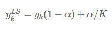
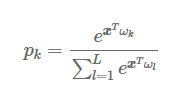

## 딥러닝 성능 평가 문제
- 질병 여부를 판단할 때 신뢰성에 대한 고려가 없다면 모델의 출력 결과인 예측 확률과 실제로 정답을 맞힐 확률이 일치하지 않는 문제가 있다.
- 일반적인 딥러닝 모델은 실제로 정답을 맞출 확률보다 자신이 예측한 결과를 확인 확신하는 경향이 있다.
- 이런 상황을 해결하기 위해 모델 보정(Model Calibration)이 필요하다.
- 딥러닝 모델이 물체를 예측한 확률(Confidence Score)과 실제 정답을 맞출 정확도(Accuracy)가 일치하도록 조정해 준다.
    - Ex) 어떤 사진을 보고 고양이일 확률을 70%로 예측한다면 실제로 정답을 맞출 확률이 70%에 가까워야 보정이 잘 이루어졌다고 말할 수 있다.
- 신뢰도 다이어그램(Reliability Diagram)을 이용해서, 주어진 모델이 얼마나 잘 보정되어 있는지 쉽게 파악할 수 있다.

- 빨간 점선으로된 대각선 모델의 예측 확률과 정확도가 일치하는 이상적인 상태(Perfect Calibration)을 보여준다.
  

## Label Smoothing
- 라벨 스무딩은 Hard Label(One-hot Encoded Vector로 정답 인덱스는 1, 나머지는 0으로 구성)을 Soft Label(라벨이 0과 1 사이의 값으로 구성)로 스무딩 하는 것을 뜻한다.
- K개의 클래스에 대해서, Smoothing Parameter를 α라고 할 때, K 번째 클래스에 대해서는 다음과 같이 스무딩 한다.

#### Example
- K=5(클래스가 5개)이고 α=0.1, 2번째 클래스가 정답인 라벨일때
- hard label: [0, 1, 0, 0, 0]
- soft label: [0.02, 0.92, 0.02, 0.02, 0.02]
- 0인 값을 0.02로 정답을 나타내는 1은 1보다 작은 0.92로 라벨 스무딩을 통해 벡터값을 변환합니다.
- 이러한 변환을 다른말로 Label-Smoothing Regularization(LSR)이라고 한다.

- 정답을 제외한 다른 클래스를 α/K로 균일 분포로 만든다.

#### Likelihood
- 네트워크 마지막 레이어의 가중치와 편향을 Wk, 입력 값을 x로 놓고, 모델이 k번째 클래스라고 예측할 가능도 이다.

- softmax??

#### Cross-entropy 적용
- 정답 타겟 yk 대힌 yk^LS를 사용하여 라벨 스무딩 효과를 적용할 수 있다.

- 이는 딥러닝 모델이 과잉 확신하는 현상을 감소해 준다.
- 기존 CrossEntropy는 양성에 대한 Loss만 계한 했지만, soft-label을 적용하여 음성에 대한 오차도 반영할 수 있다.

- x를 정답과는 가깝게 하면서도 오답과는 일정 거리를 유지하며 정답에 접근하게 된다.
- 라벨 스무딩을 적용한 모델은 동일한 범주끼리 잘 뭉친다.
- 모델의 일반화 성능을 높인다.