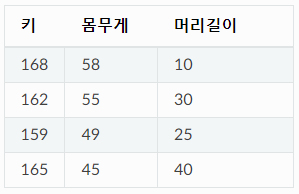

# Loss Function

## Training Loss Function

- X축 Epoch, Y축 Loss
- Epoch에 따른 Loss 결과를 표현한다.

## Weights Loss Function
- [영상 링크](https://www.youtube.com/watch?v=Q3pTEtSEvDI)
 

- X,Y 축은 Weight1, Weight2 이며 Z축은 해당 Weight일때 Loss 값을 의미한다.****
- 해당 그래프는 Weight가 2개 일 경우이며 실제 Loss Function은 시각화하기 어렵다.
- 학습 중엔 이 그래프가 뭔지 알수 없는거 아닌가?
- 1번 학습시  그 순간에 대한 기울기만 알수 있다.=> 앞으로 나아갈 방향의 기울기는 알지 못한다.=> 학습 중에는 전체 그래프를 알 수 없다. 

# Curse Of Dimensionality
- 차원의 저주란 차원이 증가하면서 학습데이터 수가 차원의 수보다 작아져서 학습이 잘 되지 않는 현상이다.
- 차원이 증가하면서 변수가 증가하고, 개별 차원 내에서 학습할 데이터 수가 적어 진다.
- 각 축은 하나의 차원(변수)이다.

#### 차원
 

- 위 데이터는 변수 3개를 가진 3차원 데이터 이다.
- 변수의 개수가 몇개인지가 몇 차원인지를 의미하고, 정리해서 차원 = 변수의 수라고 이해 할 수 있다.

 

- 차원이 늘어난다 = 변수의 수가 많아진다 = 축의 개수가 많아 진다. = 데이터의 공간이 커진다.
- 차원이 높고 데이터 개수가 적으면 차원에 해당하는 공간의 많은 경우를 확인할 수 없기 때문에 모델이 적은 학습데이터에 과도하게 학습되는 Overfitting이 된다.

#### 1차원 데이터 표현

- 1000개의 원(데이터)만 있어도 충분히 0과 1 사이 공간을 채우고 있다. 

#### 2차원 공간

- 원을 2배로 늘려서 2000개의 원을 2차원 공간에 채우면, 빈공간이 많다.
- 즉, 해당 변수의 특징을 가진 데이터가 존재 하지 않아 학습을 할 수 없다는 의미이다.

#### 출처
- https://oi.readthedocs.io/en/latest/ml/curse_of_dimensionality.html

# Linear Regression
- 머신러닝의 가장 큰 목적은 실제 데이터를 바탕으로 메들을 생성해서 다른 입력 값을 넣었을 때 아웃풋을 예측하는 데 있다.
- 이때 가장 직관 적인 모델을 Line 이다, 데이터를 놓고 그걸 가장 잘 설명할 수 있는 선분을 찾는 방법이 Linear Regression 이라 한다.
- 키와 몸무게 데이터를 펼처 놓고 그것을 가장 잘 설명할 수 있는 선을 하나 그어놓게 되면, 특정 인의 키를 바탕으로 몸무게를 예측할 수 있다.

 

- 해당 데이터를 가장 잘 설명할 수 있는 y = mx + b 를 예측 하는 것이고, 학습을 통해 m과 b 를 찾는다.

#### Linear Regression Loss

- 모든 데이터에 대해 모델의 예측 값과 실체 차이(손실)을 제곱하여 더한다. (MSE)
- 선형 모델의 목표는 모든 데이터로부터 나타나는 오차의 평균을 최소화 할 수 있는 최적의 기울기와 절편을 찾는 것이다.

#### 출처
- https://hleecaster.com/ml-linear-regression-concept/

# Logistic Regression

- 로지스틱 회귀는 회귀를 사용하여 데이터가 어떤 범주에 속할 확률을 0과 1사이의 값으로 예측하고, 그 확률에 따라 가능성이 더 높은 범주에 속하는 것으로 분류해주는 알고리즘 이다.

#### 기존 선형회귀 예측
 

- 공부한 시간이 시험에 통과를 못하고, 공부한 시간이 많으면 시험에 통과한다는 식으로 설명할 수 있다.
- 회귀 선은 '선' 이라서 확률이 음과 양의 방향으로 무한대까지 뻗어 나간다. 
- 공부를 1시간 한다면 확률이 음수 이다. <= 이런것은 범주를 해석할 수 없다. 

##### 로지스틱 회귀 예측
 

- 시험에 합격할 확률을 0과 1사이 값으로 표현한다.
1) 모든 feature의 계수와 절편을 0으로 초기화 한다.
2) 각 속성들의 값에 계수를 곱해서 log-odds를 구한다.
3) log-odds를 sigmoid 함수에 넣어서 [0,1] 범위의 확률을 구한다.

#### Log-Odds
- 선형 회귀 에서는 각 속성의 값에 계수를 곱하고 절편을 더해서 예측값을 구한다, 그래서 구한 예측값의 범위가 -∞에서 +∞ 이다.
- 로지스틱 회귀는, 마지막게 예측값 대신 Log-Odds라는걸 구해 줘야 한다.
- Odds = 사건이 발생할 확률 / 사건이 발생하지 않을 확률
  - ex) 0.7확률로 시험에 합격 한다면, 시험에서 떨어질 확률은 0.3이고 Odds = 0.7 / 0.3 = 2.33이다.
- 10번중에서 100명 떨어질동안 233명 합격한다.
- 이렇게 구한 Odds에 log를 취한 것이 log-odds이다. 

 

- 로지스틱 회귀 분석의 식을 변수 X가 성공할 확률에 대해서 정리 한다.

- 그래프로 표현하면 p는 0과 1의 값을 가진다. 
 

#### 출처
- https://hleecaster.com/ml-logistic-regression-concept/
- https://nittaku.tistory.com/478