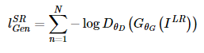
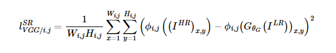

## Image Super Resolution
- 저해상도 이미지를 고해상도 이미지로 변환시키는 문제 이다.
- 과거 TV의 저해상도 HD 해상도의 영상을 UHD으로 맞게 변환하여 더욱 선명한 화질로 감상 할 수 있다.
- 우주에서 촬영한 이미지의 경우 피사체의 크기가 작아서 분별이 어려운 경우에도 SR을 적용할 수 있다.

# Super Resolution Generative Adversial Network

## Introduction

- 기존 SR 모델 중 하나인 SRResNet이 생성한 이미지를 확대하면 Origin HR Image와 비교 했을때 Texture Detail이 떨어지는 것을 볼 수 있다.
- 저자들은 이를 SR 모델들의 Loss Function에 있다고 보았다.
- 기존 SR 모델들의 목표는 복귀된 HR 이미지와 원본 이미지의 Pixel 값을 비교하여 Pixel Wise MSE를 최소화 하는 것이다.
- 그러나 Pixel Wise Loss를 사용하면 High Texture Detail을 제대로 잡아내지 못하는 문제가 있다.
- 저자들은 VGG Network의 high-level feature map을 이용한 Perceptual Loss를 제시하여 이런 문제를 해결하였다고 한다.

## 네트워크 구조


#### Generator Network
- Kernel Size : 3x3
- Kernel Channel : 64
- Stride : 1
- Batch Normalization Layer
- Activation Function : ParametricReLU
- Convolution Layer를 이용하면 Image의 차원은 작아지거나 동일하게 유지 된다.
- Super Resolution을 위해 Image의 Dimension을 증가 시켜야 하는데 이때 이용된 방식을 Sub Pixel Convolution 이라고 한다.

#### Sub Pixel Convolution

- 원본이미지가 H x W 사이즈 일때, r배로 업스케일링 된 이미지의 크기는 rH x rW이다.
- 마지막 레이어인 effcient sub-pixel convolution layer는 Low-resolution 이미지보다 r^2 만틈의 채널수로 Feature Map을 만둔 이후, feature map을 순서대로 조합해서 HR 이미지를 만든다.
- r^2배 만큼 늘어난 Feature Map은 각각 한 픽셀씩 떼와서 순서대로 조합해 HR 이미지로 Reconstruct 한다.
- 보라색 Feature Map이 49개 이고 자세히 보시면 HR 이미지 에서 보라색 픽셀이 49개 이다.(nn.PixelShuffle 레이어로 사용 가능)
- 순서 대로 조합하여 HR 이미지를 만들 수 있다.

#### Discriminator Network
- LeakyReUL를 사용하며, max-pooling은 이미지 크기를 줄이기 때문에 사용하지 않는다.
- 3x3 Kernel을 사용하는 Convolution Layer 8개로 구성
- Feature Map의 채널은 VGG 네트워크 처럼 128, 256, 512 순으로 커진다.
- Feature Map뒤에 Dense layer 2개(1024, 1)와 classification Sigmoid 가 붙는다.


## Loss Function - Perceptual Loss

- Loss Function 으로 Perceptual Loss를 사용하며 Content Loss와 Adversarial Loss로 구성되 있다.
- Adversarial Loss는 일반적인 GAN Loss와 유사 하다.
- 

#### Adverarial Loss

- ```D(G(I))```는 Generator가 생성한 이미지를 진짜라고 판단할 확률로 앞에 - 가 붙어 있으므로 이를 최소화 하는 방향으로 학습 한다.

#### Content Loss
- 
- Generator가 생성한 이미지와 Original HR 이미지로 부터 얻은 Feature Map 사이의 Euclidean Distance 를 계산한다
- Generator를 이용해 얻어낸 가짜 고해상도 이미지를 진짜 고해상도 이미지와 Pixel by Pixel로 비교하는 것을 Per-pixel Loss라고 하고 
- 입력 이미지를 CNN 모델에 통과시켜 얻어낸 feature map을 비교한는 것을 Perceptual Loss라고 한다.
- 한픽셀씩 밀려 있는 미지를 per-pixel loss를 사용하면 절대 0이 나올 수 없다. 
- 단점은 super resolution의 고질적인 문제인 Ill-posed problem 때문에 더 부각됩니다.
- Ill-posed problem이란 저해상도 이미지를 고해상도로 복원 해야 하는데, 가능한 고해상도의 이미지가 여러 개 존재하는 것을 말한다.
- GAN이 모델을 이용하여 고해상도 이미지를 구해도 MSE based Per-Pixel Loss를 사용 하면 Possible Solutions 들을 평균 내는 결과를 취하게 되므로, GAN이 생성한 다양한 High Texture Detail들이 Smoothing 되는 결과를 초래 한다.

- 이러한 단점을 보완하기 위해 Pretrained VGG 19에 통과시켜 얻은 Feature Map 사이의 Euclidean Distance를 구하여 Content Loss를 구한다.


# Enhanced Super Resolution Generative Adversrial Network

## Introduction
- SRGAN의 네트워크 구조, adversarial, perceptual loss를 연구하고 발전시켜 ESRGAN을 만들었다고 한다.
- SRGAN의 성능 향상을 위해 3가지를 변화 시켰다.
## Residual-in-residual Dense Block
- SRGAN에서는 Batch Normalization을 사용 했다.
- Training Dataset과 Test Dataset의 Statistic가 많이 달라서 오히려 BN을 사용하면 Artifact가 생기게 되고, 일반화 성능 또한 저하 된다고 한다.
- 이는 Range Flexibility가 제거 되기 때문이다. 일반적으로 Edge는 양쪽으로 밝기 차이가 많이 나는데 Feature가 Normalize되면서 이러한 밝기의 범위도 좁아지게 되면서 Smooth한 결과가 나오게 된다.
- BN Layer를 제거 함으로써 계산 복잡도와 메모리 사용량을 줄일수 있다.(이건 주객전도 아님?)

- 기존 SRResNet 구조는 그대로 가져가면서 Block만 교체 했다.
- BN Layer가 빠지고 단순히 Residual conntection을 사용하는 것이 아닌 Dens Conntection도 사용 했다.
- BN을 사용하지 않음으로 Artifact(인위적인 생성)생성을 방지 할 수 있다.

## Relativistic GAN
- 기존 GAN의 Discriminator의 역할은 입력 이미지가 Real이냐 Fake이냐를 분류 하는 것이였다.
- 하지만 Relativistic GAN의 Discriminator는 A가 B보다 진짜 같은지를 판단한다.


#### Discriminator Loss

- Xr이 Xf 보다 더 진짜 같다고 판단하게 학습니다.

#### Generator Loss

- 기존 Standard GAN과의 차이점은 Generator를 학습할 때는 보통 Real Data항은 Generator에 영향을 주지 않기 때문에 무시 된다.
- 그렇지만 Relativistic GAN에서는 Real Data가 Generator 업데이트시 영향을 준다.
- Discriminator가 Xr이 Xf보다 더 가짜라고 판단하게 학습한다.

## Perceptual Loss

- 기존에는 백본 네트워크(VGG)의 Activation 이후 Feature Map을 사용했지만 본 논문에서는 Activation 이전의 Feature Map을 사용 한다.
- Activation 이후 Feature Map을 사용하면 층이 깊어 질 수록 추상화 된다는 문제가 있다.
- Activation 이후 Feature Map은 11.17%만 활성화 된다. 이러한 희박한 활성화 뉴런은 약한 Supervision을 제공하며 성능을 낮춘다.
